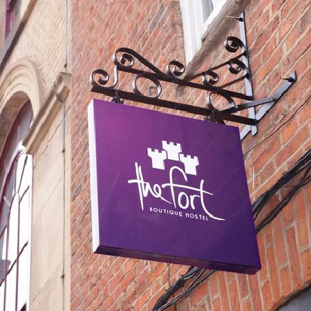

<!-- Main -->

<!-- One -->
<section id="one">
	

		<header class="major">
			<h2>Hôtels</h2>
		</header>
		Nous aimerions pouvoir vous recevoir tous, mais franchement à moins de pousser les murs et de camper très inconfortablement, ce n'est pas possible.   
     
    C'est sur cette page que vous trouverez quelques options pour dormir sur York avec une idée du prix et de la distance.
	

</section>

<!-- Two -->
<section id="two" class="spotlights">
	<section>
  		
  		

  			

  				<header class="major">
  					<h3>£££ - The Judge's Lodging</h3>
  				</header>
  				
Distance: 1 min de marche du jardin

  				
Prix: 120-130 £/nuit

  				<ul class="actions">
  					<li><a target='_blank' rel='noreferrer noopener' href="https://www.thwaites.co.uk/hotels-and-inns/inns/judges-lodging-at-york/#" class="button">En savoir plus</a></li>
  				</ul>
  			

  		

  	</section>
	<section>
  		
  		

  			

  				<header class="major">
  					<h3>££ - Travelodge Micklegate</h3>
  				</header>
  				
Distance: Micklegate, 10 minutes de marche du jardin

  				
Prix: 90-110£/nuit

  				<ul class="actions">
  					<li><a target='_blank' rel='noreferrer noopener' href="https://www.travelodge.co.uk/hotels/422/York-Central-Micklegate-hotel" class="button">En savoir plus</a></li>
  				</ul>
  			

  		

  	</section>
  	<section>
  		
  		

  			

  				<header class="major">
  					<h3>£ - L'auberge de jeunesse de luxe Fort</h3>
  				</header>
  				
Distance: Stonegate, 5 minutes de marche du jardin

  				
Prix: 75-90£/nuit

  				<ul class="actions">
  					<li><a target='_blank' rel='noreferrer noopener' href="https://www.thefortyork.co.uk/" class="button">En savoir plus</a></li>
  				</ul>
  			

  		

  	</section>
  </section>
  
  <!-- Three -->
  <section id="three">
  	

  		<header class="major">
  			<h2>Et beaucoup d'autres options</h2>
  		</header>
  		
York offre beaucoup d'endroits où dormir, notamment des B&Bs charmants avec très peu de chambres.

  		
Nous vous offrons quelques suggestions, mais si vous cherchez par vous-même - le seul risque est de trouver une perle!

  		<ul class="actions">
  			<li><a href="https://www.google.co.uk/search?q=rooms+in+york" class="button next">Chercher une perle</a></li>
  		</ul>
  	

  </section>

